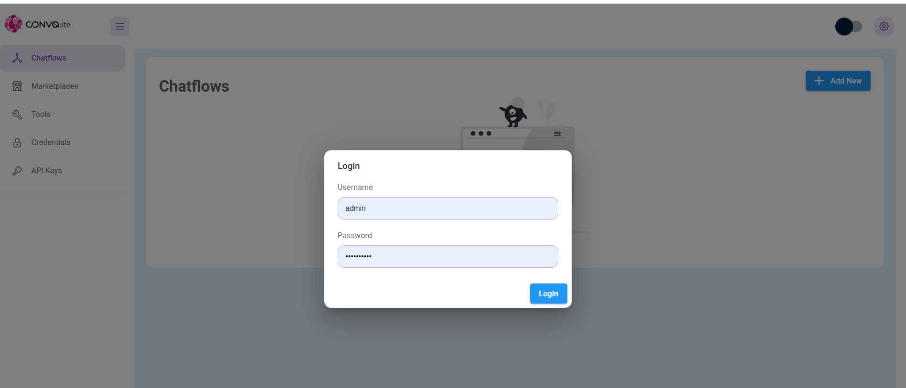

# Authorization

convosuite has 3 authorization:

* Main App level
* Flow App level
* Chatflow level

## Main App level&#x20;

Main app-level authorization grants you access to the main dashboard. You can invite your team, and after accepting the invitation, team members can log in. They will have access to internal tools. Users create their own password during the invitation process and subsequently log in using their username and password. This ensures that your main apps remain protected and are not accessible by just anyone when deployed online.

.png>)

.png>)

.png>)

.png>)

.png>)

.png>)


## Flow App Level

Flow App level authorization protects your Flow instance by username and password. This protects your apps from being accessible by anyone when deployed online.

<figure><figcaption></figcaption></figure>

See how to set username & password [Broken link](broken-reference "mention")

## Chatflow level

Imagine you have a chatflow constructed, and you only want certain people to be able to access and interact with it. You can achieve that by assigning an API key for that specific chatflow.

### API Key

In dashboard, navigate to API Keys section, and you should be able to see a DefaultKey created. You can also add or delete any keys.

### Chatflow

Navigate to the chatflow, and now you can select the API Key you want to use to protect the chatflow.

<div>

<figure><figcaption></figcaption></figure>

 

<figure><figcaption></figcaption></figure>

</div>

After assigning an API key, one can only access the chatflow API when the Authorization header is provided with the correct API key specified during a HTTP call.

```json
"Authorization": "Bearer <your-api-key>"
```

An example of calling the API using POSTMAN

<figure><figcaption></figcaption></figure>

You can specify the location where the api keys are stored by specifying `APIKEY_PATH` env variables. Read more [Broken link](broken-reference "mention")
