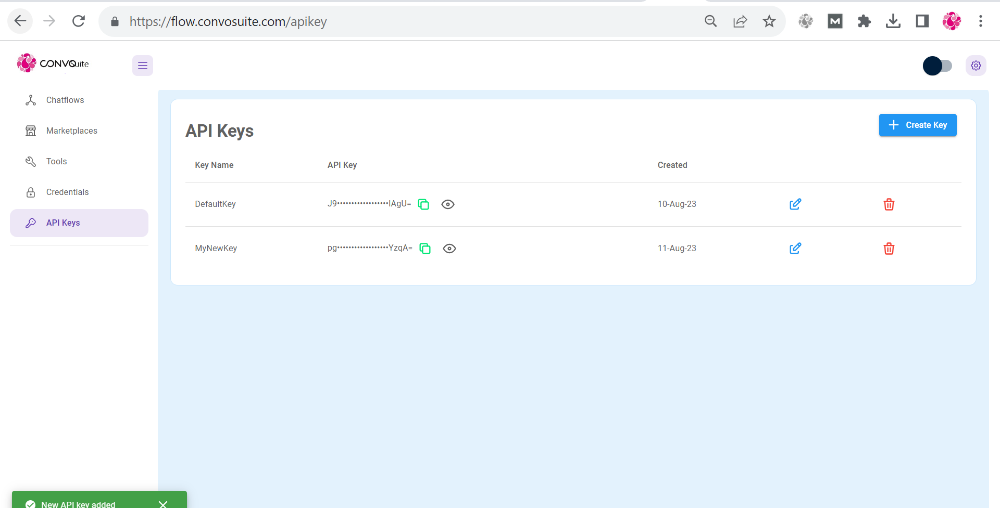

# Authorization

Flow has 2 authorization:

* App level
* Chatflow level

## App Level

App level authorization protects your Flow instance by username and password. This protects your apps from being accessible by anyone when deployed online.

<figure><figcaption></figcaption></figure>

See how to set username & password [Broken link](broken-reference "mention")

## Chatflow level

Imagine you have a chatflow constructed, and you only want certain people to be able to access and interact with it. You can achieve that by assigning an API key for that specific chatflow.

### API Key

In dashboard, navigate to API Keys section, and you should be able to see a DefaultKey created. You can also add or delete any keys.

### Chatflow

Navigate to the chatflow, and now you can select the API Key you want to use to protect the chatflow.

<div>

<figure><figcaption></figcaption></figure>

 

<figure><figcaption></figcaption></figure>

</div>

After assigning an API key, one can only access the chatflow API when the Authorization header is provided with the correct API key specified during a HTTP call.

```json
"Authorization": "Bearer <your-api-key>"
```

An example of calling the API using POSTMAN

<figure><figcaption></figcaption></figure>

You can specify the location where the api keys are stored by specifying `APIKEY_PATH` env variables. Read more [Broken link](broken-reference "mention")
