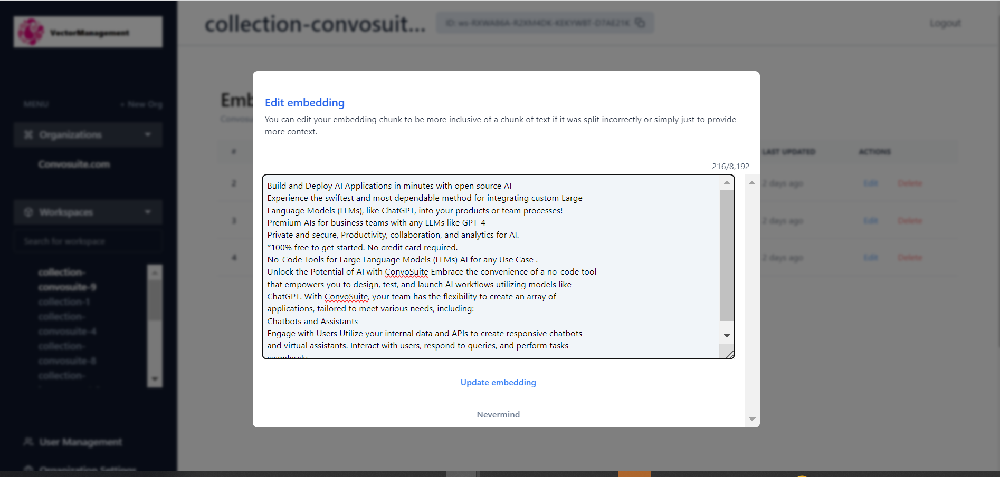

# Vector Management

**Quick!** _Exactly_ what information is embedded in your Pinecone or Chroma vector database?&#x20;

The Vector Management UI Suite for Vector Databases can reduce embedding costs by 75% and allows you to upload large folders directly.&#x20;

_Overview:_\
Vector Management provides a user interface for managing your Pinecone or Chroma vector database. It offers tools and functionalities to help streamline the handling of vector data without having to rely heavily on API calls.

**Key Features:**

* **User Interface**: A straightforward GUI for vector database management.
* **Full Control**: The system allows users to view and manage their vector data, even if incorporated using tools like LangChain.
* **Local and Remote Usage**: It can run both locally using Docker and remotely, accommodating various vector databases simultaneously.
* **Comprehensive Tool Suite**: Vector Management comprises a suite designed for easy interaction with vectorized text, integrating the functionalities of traditional database systems.

_Functionalities:_

* Support for multiple user instances.
* Ability to view, update, or delete specific segments of text.
* Copying capability for documents or entire namespaces without the need for re-embedding.
* Direct functionality to upload and embed new documents.
* Option to migrate between different vector databases (still in development).
* Capability to manage several vector databases at once.
* Data permission settings.
* Compatibility with cloud deployment.
* Automated regression testing for updated documents (work in progress).
* Integration with API, Javascript, and Python clients, as well as LangChain (still in development).
* Efficient handling methods for large document embedding.

.png>)

.png>)

.png>)

